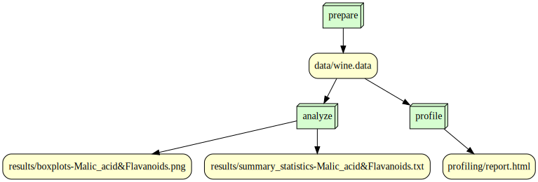

# is477-fall2023-final-project

## Overview
This project performed summary statistics on malicacids and flavanoids in a wine chemical analysis dataset. The purpose is to observe the statistical values of the target data in more detail for future research. The database is the result of a chemical analysis of wines grown in the same region of Italy but from three different varieties, which contain the quantities of 13 constituents found in each of the three types of wines. This project only selected two of them for statistics, namely malicacids and flavanoids. The statistical results mainly involve the mean, standard deviation, and quarter values. The statistical results are visualized with a box plot.

## Analysis
After running analysis.py, you can automatically get a result file. In the result file, the box plot (png file) is a visualization of the summary statistic file (txt file), and the information they express is consistent. There is some common information between the values of malicacids and flavanoids. Both of their values range from 0 to 6, with the average close to 2, the maximum close to 5, and the Q3 (75%) close to 3. It is worth noting that, on the whole, there are three upper-outlier malicacid values for wines from this region. Excluding the outlier, the effective maximum malicacid value for wine in this region should actually be considered to be around 5.2.

## Workflow

## Reproducing
Some necessary software/modules you may need to install:
1. Compiler: Visual Studio Code (recommended)
2. Python 3.10 (or above)
3. Python modules: requests, pandas, ydaya-profiling, snakemake, matplotlib (all listed in requirement.txt)

After optionally installing the above requirements, you can create a new folder locally and clone the repository.

After cloning is complete, you can directly run **prepare_data.py** in the compiler to get the necessary data (the data will be located in “./data”). After getting the necessary data, you can also directly run **analysis.py** to generate analysis charts and document (the data will be located in “./results”) and **profile.py** to complete the data profiling process (the data will be located in “./profiling”).

---

Option 1: You can also run the repository through the provided snakefile. It will have the same function as above.

Run the following code in sequence (windows):

``snakemake --cores 1 prepare``

``snakemake --cores 1 profile``

``snakemake --cores 1 analyze``

---

Option 2: You also can do the same thing using Docker.

In your Vscode, run the following code to download the Docker image I provided (windows):

``docker pull zijiez4/is477-fall2023-final-projet:v1 ``

Run the following code in sequence to complete the reproduction (windows):

`` docker run --rm -v ${PWD}:/is477 zijiez4/is477-fall2023-final-project:v1 snakemake --cores 1 prepare``

`` docker run --rm -v ${PWD}:/is477 zijiez4/is477-fall2023-final-project:v1 snakemake --cores 1 profile``

`` docker run --rm -v ${PWD}:/is477 zijiez4/is477-fall2023-final-project:v1 snakemake --cores 1 analyze``

## License

### Repository: MIT License

Permission is hereby granted, free of charge, to any person obtaining a copy of this software and associated documentation files (the "software") to deal in the software without restriction, including without limitation the rights to use, copy, modify, merge, publish, distribute, sublicense, and/or sell copies of the software, and to permit persons to whom the software is furnished to do so, subject to the conditions that the above copyright notice and this permission notice shall be included in all copies or substantial portions of the software.

### Wine Dataset: Creative Commons Attribution 4.0 International (CC BY 4.0) License

This allows for the sharing and adaptation of the datasets for any purpose, provided that the appropriate credit is given.

## References
Aeberhard,Stefan and Forina,M.. (1991). Wine. UCI Machine Learning Repository. https://doi.org/10.24432/C5PC7J.
